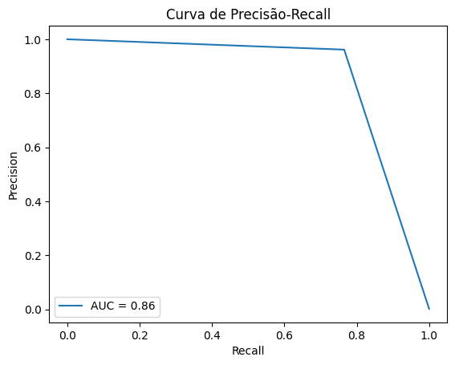
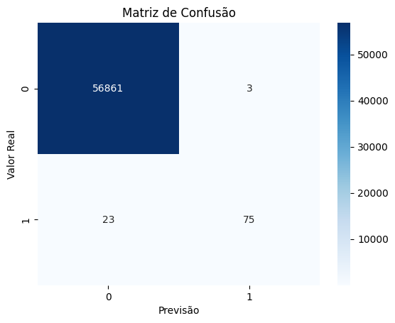

# Previsão de Fraude em Transações de Cartão de Crédito com Random Forest

Bem-vindo ao meu projeto de Previsão de Fraude em Transações de Cartão de Crédito! 🚀 Como um cientista de dados júnior, quero compartilhar como utilizei um modelo de Random Forest para detectar transações fraudulentas.

## Conjunto de Dados

O conjunto de dados utilizado contém informações sobre transações de cartão de crédito, com um foco especial na identificação de transações fraudulentas.

## Etapas do Projeto

Aqui está um resumo das etapas que segui neste projeto:

1. **Exploração de Dados**: Realizei uma análise descritiva e visualizei dados para entender melhor a estrutura do conjunto.
2. **Preparação de Dados**: 
   - Dividi os dados em features e target.
   - Realizei a divisão do conjunto em treinamento e teste.
3. **Construção do Modelo**: 
   - Utilizei o RandomForestClassifier com pesos balanceados para lidar com o desbalanceamento das classes.
4. **Treinamento do Modelo**: 
   - Treinei o modelo com os dados de treinamento.
5. **Avaliação do Modelo**: 
   - Avaliei o desempenho utilizando métricas como acurácia, precisão, recall e matriz de confusão.
6. **Visualização de Resultados**: 
   - Criei gráficos para visualizar a curva de precisão-recall e a matriz de confusão, facilitando a análise do desempenho do modelo.

## Tecnologias Utilizadas

Para desenvolver este projeto, utilizei:

- Python
- Pandas
- Scikit-learn
- Matplotlib
- Seaborn

## Como Executar o Projeto

Se você quiser experimentar, siga estes passos:

1. Faça o download do conjunto de dados e do notebook.
2. Abra o notebook no Google Colab ou no Jupyter Notebook.
3. Execute.

## Análise dos Gráficos

### 1. Curva de Precisão-Recall

*Este gráfico mostra a relação entre precisão e recall, ajudando a entender o desempenho do modelo.*

Insights:

A área sob a curva (AUC) mostra como o modelo está indo no geral. Quanto maior for o AUC, melhor o modelo é em identificar fraudes (classe positiva) sem marcar coisas erradas como fraude.

Se o modelo consegue manter um bom equilíbrio entre precisão (quando acerta) e recall (quando encontra a fraude), isso significa que ele está identificando fraudes sem exagerar nas classificações erradas, o que é ótimo.

### 2. Matriz de Confusão

*A matriz de confusão mostra quantas previsões foram corretas e incorretas em cada classe.*

Aqui está uma versão mais simples e humana:

Insights:

Os verdadeiros positivos (TP) mostram quantas fraudes o modelo acertou em identificar.

Os falsos positivos (FP) indicam quantas transações normais foram classificadas como fraudes por engano, o que pode causar preocupação nos clientes.

Olhar para esses números nos ajuda a ver o quão bem o modelo está funcionando e se precisamos fazer ajustes, como mudar o limite de decisão ou equilibrar melhor as classes.

## Contribuições

Estou aberto a contribuições! Se você tiver sugestões ou melhorias, sinta-se à vontade para abrir issues ou pull requests.
🌟
