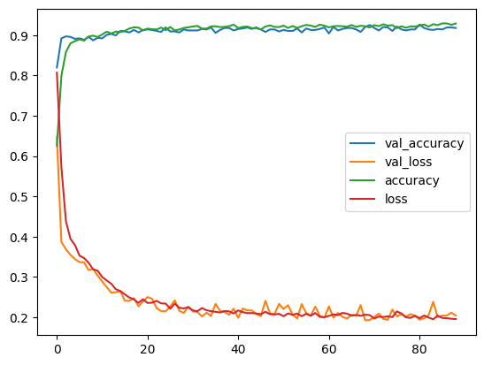
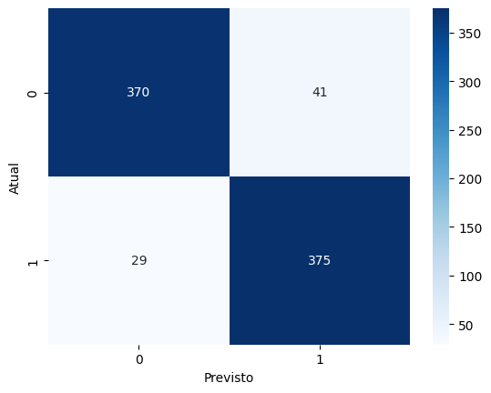
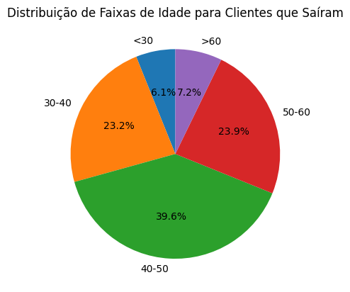

# Previsão de Churn de Clientes com Redes Neurais

Bem-vindo ao meu projeto de Previsão de Churn de Clientes! 🚀 O objetivo aqui é identificar quais clientes têm uma alta probabilidade de deixar o banco, permitindo ações preventivas que podem melhorar a retenção.

## Conjunto de Dados

O conjunto de dados que utilizei é bem completo, contendo informações sobre clientes do banco, como dados demográficos, transações e comportamentos. Isso nos ajuda a entender melhor o perfil dos clientes e suas tendências.

## Etapas do Projeto

Aqui está um resumo das etapas que segui neste projeto:

1. **Exploração de Dados**: Fiz uma análise descritiva, visualizei os dados e tratei dados faltantes.
2. **Preparação de Dados**: 
   - Codifiquei variáveis categóricas para que pudessem ser processadas.
   - Abordei o desbalanceamento de classes para garantir que o modelo aprendesse de forma eficaz.
   - Normalizei as características para otimizar o desempenho do modelo.
3. **Construção do Modelo**: 
   - Utilizei Keras para criar uma rede neural com camadas densas, dropout e uma função de ativação sigmoid.
4. **Treinamento do Modelo**: 
   - Treinei o modelo usando o otimizador Adam e a função de perda binary crossentropy.
   - Apliquei early stopping para evitar overfitting, o que é muito importante.
5. **Avaliação do Modelo**: 
   - Avaliei o desempenho do modelo com métricas como acurácia, precisão, recall e matriz de confusão.
6. **Visualização de Resultados**: 
   - Criei gráficos que ajudam a visualizar a performance do modelo e a distribuição do churn entre os clientes.

## Tecnologias Utilizadas

Para desenvolver este projeto, utilizei:

- Python
- Pandas
- Scikit-learn
- Keras
- Matplotlib
- Seaborn
- IPython

## Como Executar o Projeto

Se você quiser experimentar, siga estes passos:

1. Faça o download do conjunto de dados e do notebook.
2. Abra o notebook no Google Colab ou em um ambiente Jupyter Notebook.
3. Execute!

## Análise dos Gráficos

### 1. Gráfico de Acurácia e Perda do Modelo

*Este gráfico mostra a evolução da acurácia e da perda durante o treinamento e validação do modelo. Ele nos ajuda a entender se o modelo está aprendendo de forma eficaz. A convergência das curvas indica que o modelo está se ajustando bem aos dados.*

Insight:

A acurácia de treino vai melhorando conforme o modelo aprende, e a perda de treino diminui, mostrando que ele está se ajustando aos dados.

Por outro lado, se a acurácia de validação parar de aumentar ou começar a cair e a perda de validação subir, isso pode ser um sinal de que o modelo está se "decorando" os dados de treino em vez de aprender a generalizar.

Se as curvas de validação se estabilizarem em bons valores, isso significa que o modelo está funcionando bem com novos dados e não está apenas memorizando os de treino.

### 2. Matriz de Confusão

*A matriz de confusão ilustra quantas previsões foram corretas e incorretas.*

Insight:

Na matriz de confusão, a linha diagonal mostra as previsões que o modelo acertou, enquanto os números fora dessa linha mostram os erros.

Esse gráfico ajuda a ver onde o modelo está acertando e onde está errando. Por exemplo, se ele acerta bem os clientes que não saíram, mas erra nos que saíram, pode ser um sinal de que o modelo está desequilibrado ou com viés.

Se a maioria dos valores estiver na diagonal principal, isso quer dizer que o modelo está funcionando bem.

### 3. Distribuição de Características

*Esse gráfico de pizza mostra a distribuição de uma característica específica entre os clientes que saíram.*

Insight:

Esse gráfico ajuda a entender quais grupos de clientes têm mais chance de sair (churn). Por exemplo, se muitos clientes que saíram têm entre 30 e 40 anos ou saldo abaixo de 50 mil, a empresa pode focar suas campanhas de retenção nesses grupos.

Também dá para ver se o churn é mais comum em clientes com certa pontuação de crédito, o que ajudaria a empresa a entender como a situação financeira impacta a saída de clientes.

## Contribuições

Estou aberto a contribuições! Se você tiver sugestões ou melhorias, sinta-se à vontade para abrir issues ou pull requests. 🌟
