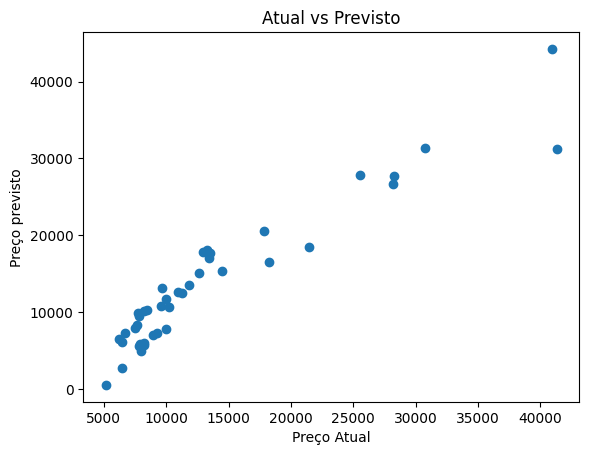

# Previsão dos Preços de Carros Usando Regressão Linear

Bem-vindo ao meu projeto de Previsão dos Preços de Carros. O objetivo é desenvolver um modelo que ajude a entender quais fatores influenciam o preço dos veículos.

## Conjunto de Dados

O conjunto de dados utilizado contém informações sobre diferentes carros, incluindo características como tipo de motor, localização do motor, sistema de combustível e outros fatores relevantes. 

## Etapas do Projeto

Aqui está um resumo das etapas que segui neste projeto:

1. **Exploração de Dados**: Carreguei e analisei o conjunto de dados, verificando a presença de valores nulos ou duplicados.
2. **Pré-processamento de Dados**:
   - Realizei o one-hot encoding para variáveis categóricas.
   - Visualizei a correlação entre as características e o preço, identificando as mais importantes.
   - Removi colunas com pouco valor preditório.
3. **Divisão dos Dados**: Separei os dados em conjuntos de treinamento e teste.
4. **Construção do Modelo**: Utilizei o `LinearRegression` da biblioteca Scikit-learn para criar e treinar o modelo.
5. **Avaliação do Modelo**: Avaliei o desempenho do modelo com métricas como MAE, MSE e R².
6. **Visualização de Resultados**: Criei gráficos para comparar os preços reais com os previstos, ajudando a entender a eficácia do modelo.

## Tecnologias Utilizadas

Para desenvolver este projeto, utilizei:

- Python
- Pandas
- NumPy
- Scikit-learn
- Matplotlib
- Seaborn

## Como Executar o Projeto

Se você quiser experimentar, siga estes passos:

1. Faça o download do conjunto de dados e do notebook.
2. Abra o notebook no Google Colab ou em um ambiente Jupyter Notebook.
3. Execute.

## Análise dos Gráficos

### 1. Gráfico de Dispersão: Preços Reais vs. Preços Previstas

*Este gráfico ilustra a relação entre os preços reais e os preços previstos pelo modelo.*

Insight:

O ideal é que os pontos desse gráfico se alinhem em torno de uma linha reta, mostrando que as previsões estão próximas dos valores reais. Se houver desvios grandes, isso significa que o modelo não está capturando bem a relação entre os dados e o preço dos carros.

Além disso, se os pontos estiverem muito espalhados, pode indicar a presença de outliers ou que o modelo precisa ser ajustado melhor para certos tipos de carros.

## Contribuições

Estou aberto a contribuições! Se você tiver sugestões ou melhorias, sinta-se à vontade para abrir issues ou pull requests.
