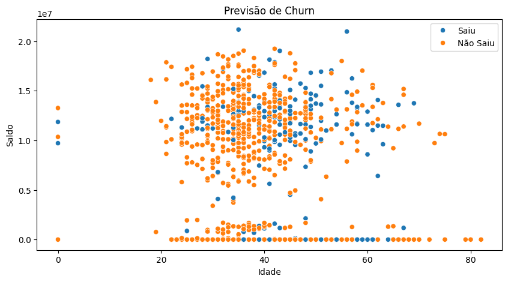
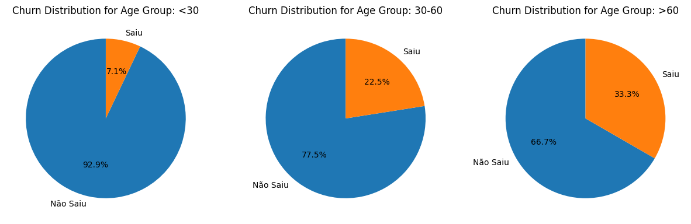
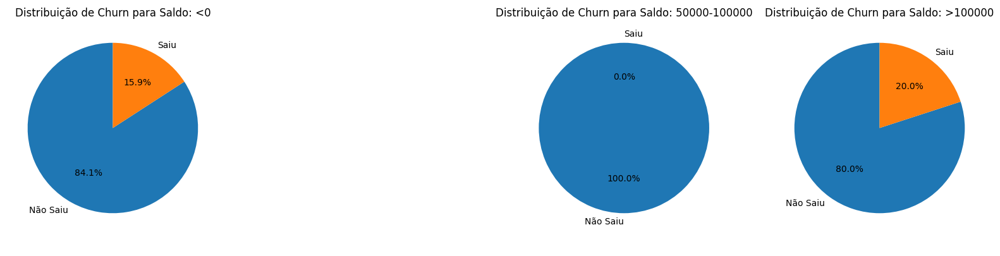

# Limpeza e Tratamento de Dados/ Regressão Logística

Bem-vindo ao meu projeto de Limpeza e Tratamento de Dados/Regressão Logística. O objetivo é prever o churn de clientes usando regressão logística.

## Conjunto de Dados

O conjunto de dados utilizado contém informações sobre clientes, como pontuação, estado, gênero, idade, patrimônio e saldo. 

## Etapas do Projeto

Aqui está um resumo das etapas que segui neste projeto:

1. **Carregamento e Exploração dos Dados**: Carreguei o conjunto de dados e examinei suas características e possíveis inconsistências.
2. **Pré-processamento**:
   - Renomeei colunas para facilitar a manipulação.
   - Realizei a limpeza de dados, tratando valores nulos, duplicados e outliers.
   - Apliquei o `LabelEncoder` para converter variáveis categóricas em valores numéricos.
3. **Balanceamento dos Dados**: Utilizei a técnica SMOTE para lidar com o desbalanceamento de classes.
4. **Divisão dos Dados**: Separei os dados em conjuntos de treinamento e teste.
5. **Construção do Modelo**: Treinei um modelo de regressão logística com os dados processados.
6. **Avaliação do Modelo**: Utilizei métricas de desempenho para avaliar a acurácia do modelo e visualizei os resultados.

## Tecnologias Utilizadas

Para desenvolver este projeto, utilizei:

- Python
- Pandas
- NumPy
- Matplotlib
- Seaborn
- Scikit-learn
- Imbalanced-learn

## Como Executar o Projeto

Se você quiser experimentar, siga estes passos:

1. Faça o download do conjunto de dados e do notebook.
2. Abra o notebook no Google Colab ou em um ambiente Jupyter Notebook.
3. Execute.

## Análise dos Gráficos

### 1. Gráfico de Dispersão: Idade vs. Saldo

*Este gráfico ilustra a relação entre a idade e o saldo dos clientes, ajudando a visualizar a distribuição do churn.*

Aqui está a versão mais simples e direta desse insight:

Insight:

Esse gráfico pode mostrar como saldo e idade se relacionam com o churn. Por exemplo, ele pode indicar se clientes mais velhos e com saldo maior têm menos chances de sair, ou o contrário.

Se houver uma concentração de pontos em certas áreas, isso pode ajudar a identificar perfis de clientes que têm maior chance de churn.

### 2. Gráficos de Pizza: Distribuição de Churn por Faixa Etária e Saldo

*Esses gráficos mostram a distribuição de clientes que saíram ou não, segmentados por faixas etárias e saldo.*

Insights:

1 - O gráfico ajuda a identificar qual faixa etária tem maior rotatividade. Isso é útil para personalizar estratégias de retenção. Por exemplo, se a faixa abaixo de 30 anos mostra uma alta taxa de churn, pode ser necessário implementar ações específicas para esse grupo.

2 - Também permite entender como o saldo dos clientes impacta suas decisões de sair ou ficar. Se os clientes com saldo acima de 100.000 têm baixas taxas de churn, isso pode indicar que clientes mais ricos tendem a ser mais leais à empresa.

## Contribuições

Estou aberto a contribuições! Se você tiver sugestões ou melhorias, sinta-se à vontade para abrir issues ou pull requests.

