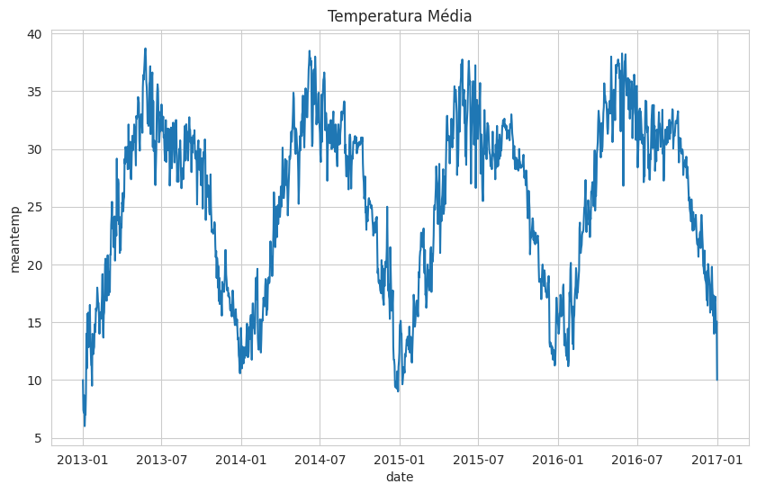
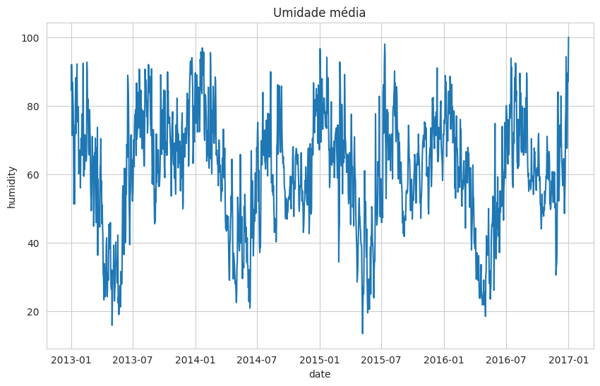
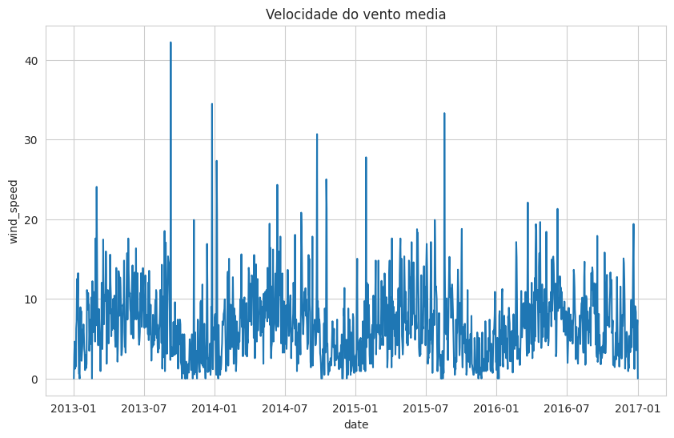
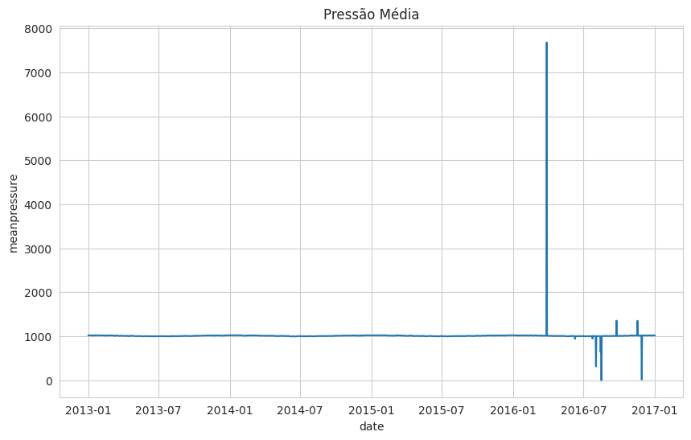
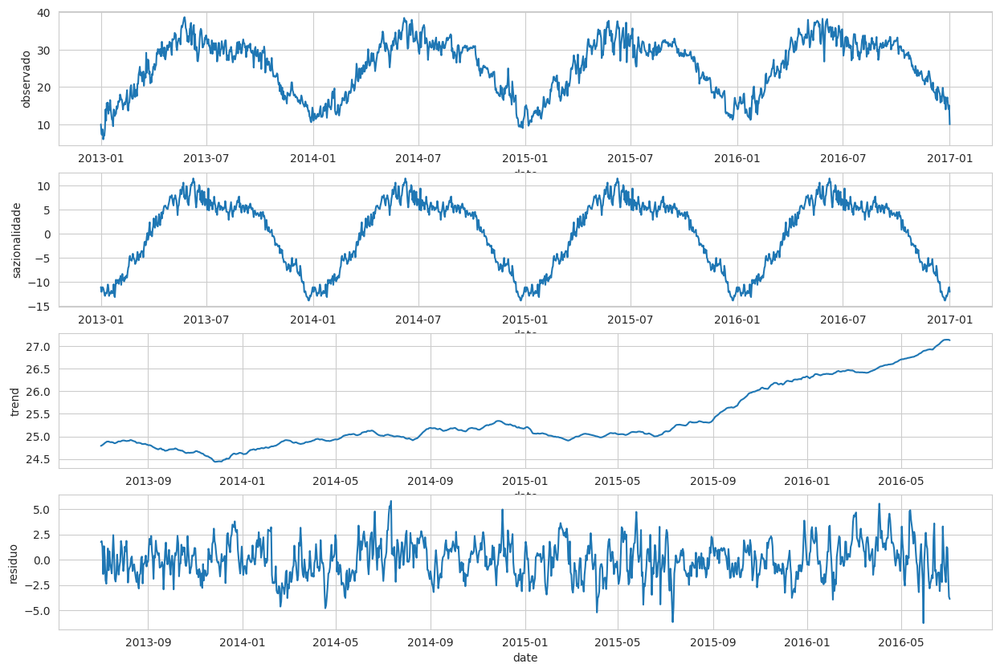
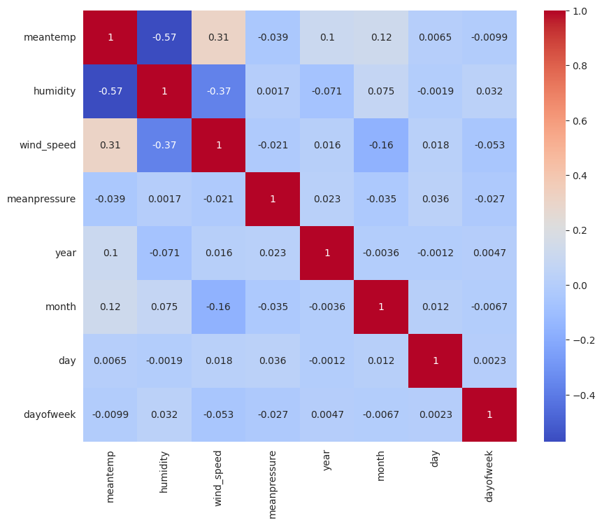
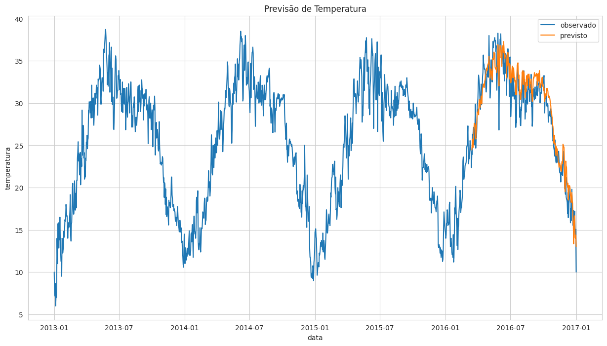
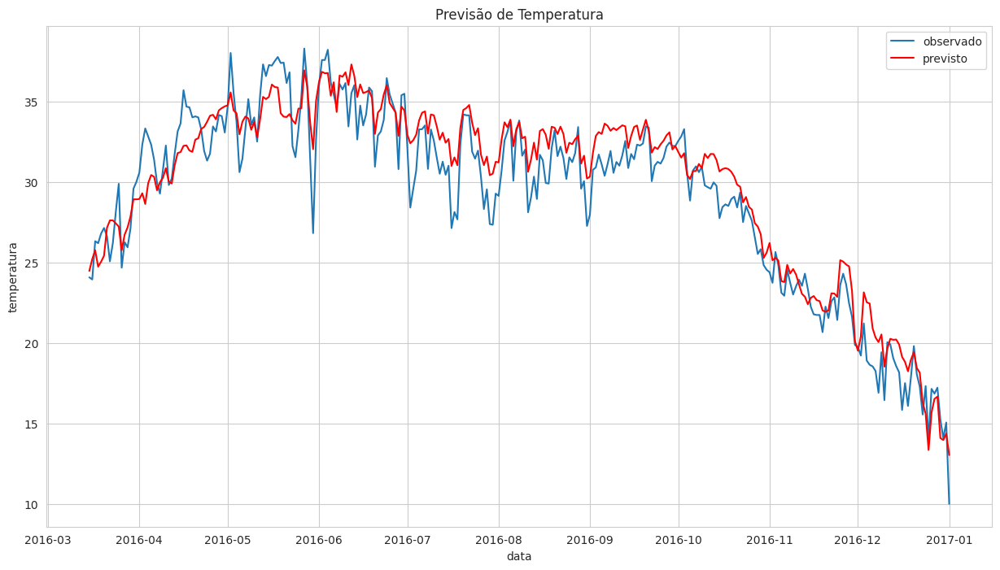

# Previsão de Temperatura com Análise Sazonal

Bem-vindo ao meu projeto de Previsão de Temperatura. Neste projeto, utilizei técnicas de análise de séries temporais para prever a temperatura média diária em Delhi, com base em dados históricos.

## Conjunto de Dados

O conjunto de dados utilizado neste projeto é o "DailyDelhiClimateTrain.csv", que contém informações diárias sobre temperatura, umidade, velocidade do vento e pressão atmosférica.

## Etapas do Projeto

Aqui está um resumo das etapas que segui neste projeto:

1. **Importação de Bibliotecas**: Utilizei bibliotecas como pandas, numpy, seaborn, matplotlib e Prophet para manipulação de dados e modelagem.
2. **Carregamento e Visualização dos Dados**: Carreguei o conjunto de dados e visualizei suas primeiras linhas, além de verificar valores nulos e duplicados.
3. **Pré-processamento**:
   - Convertemos a coluna de data para o tipo datetime e a definimos como índice.
   - Extraí informações como ano, mês, dia e dia da semana.
4. **Visualização Inicial**: Criei gráficos de linha para temperatura média, umidade, velocidade do vento e pressão média, facilitando a análise visual.
5. **Decomposição Sazonal**: Realizei a decomposição sazonal da temperatura média, destacando componentes como tendência, sazonalidade e resíduos.
6. **Análise de Correlação**: Gerei gráficos de correlação para entender a relação entre as variáveis meteorológicas.
7. **Criação do Modelo**: Utilizei o Prophet para modelar a série temporal e fiz previsões para os dados futuros.
8. **Avaliação do Modelo**: Calculei métricas como erro quadrático médio (MSE) e coeficiente de determinação (R²) para avaliar a precisão das previsões.
9. **Visualização das Previsões**: Criei gráficos comparativos entre os valores observados e previstos para entender a eficácia do modelo.

## Tecnologias Utilizadas

Para desenvolver este projeto, utilizei:

- Python
- Pandas
- Numpy
- Matplotlib
- Seaborn
- Statsmodels
- Prophet

## Como Executar o Projeto

Se você deseja experimentar, siga estes passos:

1. Faça o download do conjunto de dados e do notebook.
2. Abra o notebook no Google Colab ou em um ambiente Jupyter Notebook.
3. Execute.

## Análise dos Gráficos

### 1. Gráficos de Linha para Variáveis Meteorológicas

*Este gráfico mostra a variação da temperatura média ao longo do tempo, evidenciando tendências e padrões sazonais.*

Insights:

Temperatura Média: Este gráfico mostra como a temperatura média muda ao longo do tempo. É possível notar padrões sazonais, como temperaturas mais altas em determinados meses, o que pode ser útil para planejar atividades.

Umidade Média: A umidade também varia ao longo do ano. Analisar essas variações pode ajudar a entender como a umidade se relaciona com a temperatura, o que é importante para prever o clima.

Velocidade do Vento Média: Este gráfico mostra as mudanças na velocidade do vento. Essas oscilações são relevantes para a previsão do clima e podem impactar atividades ao ar livre, como esportes ou passeios.

Pressão Média: A pressão atmosférica pode indicar mudanças no clima. Se o gráfico é estável, isso sugere um padrão previsível. No entanto, flutuações abruptas podem sinalizar a aproximação de tempestades.

### 2. Gráficos de Decomposição Sazonal

*Aqui, visualizamos a decomposição da temperatura média em componentes de tendência, sazonalidade e resíduos, permitindo uma análise mais profunda dos padrões.*

Insight: A decomposição mostra a tendência, a sazonalidade e o resíduo da temperatura média. Isso permite identificar se as variações são sazonais ou se há uma tendência de longo prazo.

### 3. Gráficos de Correlação

*Este mapa de calor ilustra a correlação entre as variáveis meteorológicas.*

Insight: O mapa revela como as variáveis meteorológicas estão correlacionadas. Por exemplo, uma alta correlação entre temperatura e umidade sugere que, em meses quentes, a umidade tende a ser maior.

### 4. Gráficos de Previsão

*Esses gráficos comparam os valores reais e previstos da temperatura.*

Insight: Esse gráfico mostra como as previsões do nosso modelo se comparam com os valores reais. Se as linhas estão bem próximas, isso significa que nosso modelo está fazendo um bom trabalho ao capturar a tendência dos dados.

Insight: Aqui, nós conseguimos ver como o modelo se sai com dados novos, aqueles que ele nunca viu antes. Se as previsões estiverem boas, isso é um sinal de que o modelo está entendendo bem os padrões.

## Contribuições

Estou aberto a contribuições! Se você tiver sugestões ou melhorias, fique à vontade para abrir issues ou pull requests.
